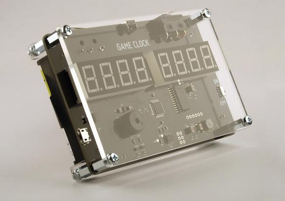
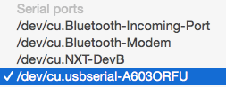

# Game Clock

Play "blitz chess" like a real hacker, with our modern-retro Arduino-compatible **Game Clock**! 

If you play any game that requires accurate timekeeping, you will love the **Game Clock**. Designed
 with high quality snap action switches and a high-precision real-time clock, the **Game Clock** 
will react to your touch within milliseconds. While similar devices typically come in a boring
 beige enclosure, the **Game Clock** is proudly exposing it's internal circuitry and deep black PCB 
in a fully transparent 3mm acrylic laser-cut enclosure. It is primarily designed for chess games that
 are played in contrained times, but offers plenty of configurability. The device can be powered by 
2 AA batteries or a USB cable, so you can take it anywhere. 

The **Game Clock** also comes a truly hackable device. Open source and open hardware, it can be 
fully reprogrammed in the Arduino environement to suit the most exotic needs. The **Game Clock** 
features an XBee compatible socket for optional low power networking: imagine keeping track of all
games in a chess tournament in real time!

The **Game Clock** features:

- two 4-digit red led displays, 
- two high quality Honeywell snap action switches and a tact switch,
- an Atmel ATmega328PB microcontroller with 32K flash and 2K SRAM / 1K eeprom,
- an extremely accurate I2C-Integrated RTC, the DS3231, with an accuracy of 2ppm over 0 to 40C,
- a battery holder for two AA batteries,
- a USB socket,
- a 20-pin XBee socket for the addition of an _optional_ wireless module,
- voltage regulation circuitry provding 4.9V to the MCU and an optional 3.3V for a wireless module,
- a buzzer.

Most of all, it looks cool!

## Using the Game Clock

_We should add a brief user manual here for the default firmware, the setup, modes, etc or a link to a PDF/DOC_

## Hardware overview

**Power**: The Game Clock can be powered with:

- 2 x AA alkaline or rechargeable batteries (recommended for portable use)
- USB (for continuous usage)
- Serial Port / ISP Header (during programming, debugging, etc.)

An boost regulator assures constant voltage to the device regardless of the power source used. 
USB power always takes priority over battery power.

A small switch allows to power the device on or off.

**Microcontroller**: At the heart of the Game Clock is an ATmega328PB microcontroller running at 8MHz
and 4.9 volts. It features 32K flash, 2K SRAM and 1K EEPROM. This is the new and updated version of
the classic microcontroller that you may find on the Arduino UNO boards. It comes proprogrammed with
a serial bootloader that uses 8K of flash.

**Buttons**: The Game Clock features two high quality snap action micro switches rated for 10 million 
cycles! In addition a traditional tact switch is seated in the center top of the board, notably to 
access various configuration options.

**Display**: The device can display information to the user through 8 red LED digits, physically split
in two two 4-digit red LED displays, typically used during game play to show the time available to each
player. The LED display is controlled by a MAX7219CWG IC through SPI, with software controlled brightness. 

**Sound**: The Game Clock is fitted with a passive buzzer capable of playing tones of varying 
frequencies, providing audio feedback to users.

**Real time clock**: The circuit features a DS3231M IC, a very accurate RTC with an integrated callibrated
and temperature compensated oscillator. It communicates with the MCU using the I2C bus. 

**XBee headers**: The gameclock has a 20-pin header that allows it to be optionally connected to an XBee
wireless communication module. An onboard 3.3 LDO and voltage shifting circuit assures compatibility between
the MCU and the XBee logic levels. In order to conserve energy, the 3.3V LDO is disabled by default and
can be enabled by software on the MCU when necessary.  

## Arduino compatibility

The Game Clock is built around an Atmel ATmega328PB, and can be programmed like a classic Arduino UNO R3, 
using the Arduino IDE without any additional software installation. 

A USB to serial board is required (not included) to upload software from the Arduino IDE to the Game Clock 
using the 6-pin connector located at the back of the device. 
We use and recommend the SparkFun FTDI Basic Breakout. It's hassle free and easy to plug into the
Game Clock.

### Configuring the Arduino IDE

The built-in board definition for the "Arduino Pro or Pro Mini" in the Arduino 1.8 IDE is all you need to 
start programming the Game Clock with your own software.

Select "Tools" in the menu and select "Board" :

Choose the "Arduino Pro or Pro Mini" board:

Select "Tools" from the menu and then "Processor":

Choose "ATmega328P (3.3V, 8MHz)":

Your Arduino IDE is now correctly configured to write software for the Game Clock.
To upload a sketch, please check out the following isntructions.

### Serial Port Programming

Plug your USB to Serial adapter into the Game Clock's 6-pin serial connector.
If needed, the serial pin are identified on the silkscreen at the back of the Game Clock PCB,
so that you can check your connection.

In the Arduino IDE, select "Tools" and then "Port":

Select your serial port (yours will have a different identifier):

You can now upload a sketch to your device!

### Arduino Pins

The following table summarizes the wiring of the Game Clock MCU: 

| Arduino Pin     | ATmega328pb pin     | Input/Output  | Description
|:---------------:|:-------------------:|:-------------:|:-------------------:
| 0               | PD0                 | Input         | Serial RX for Arduino programming and optional XBee communication.
| 1               | PD1                 | Output        | Serial TX for Arduino programming and optional XBee communication.
| 2               | PD2                 | Input         | Left snap action switch (active low)
| 3               | PD3                 | Input         | Right snap action switch (active low)
| 4               | PD4                 | Input         | Center tact switch (active low)
| 5               | PD5                 | N.C.          | _Unused_
| 6               | PD6                 | Output        | Buzzer
| 7               | PD7                 | Output        | Enables the 3.3V LDO
| 8               | PB0                 | Input         | Connected to the SQW pin of the DS3231 RTC
| 9               | PB1                 | Input         | Optional XBee RSSI
| 10, 11, 12, 13  | PB2, PB3, PB4, PB5  | Input/Output  | SS, MOSI, MISO and CLK for SPI connection to ICSP port and MAX7219 LED driver.
| 14 (A0)         | PC0                 | Output        | Optional XBee RTS
| 15 (A1)         | PC1                 | Input         | Optional XBee CTS
| 16 (A2)         | PC2                 | Input         | Optional XBee ASSOC  
| 17 (A3)         | PC3                 | Input         | Input voltage level sensing, either (1) battery voltage or (2) USB voltage - 0.6V
| 18, 19 (A4, A5) | PC4, PC5            | Input/Output  | SDA and SCL for I2C connection to the DS3231 RTC
| N/A             | PB6                 | Input         | Connected to the CLK32K pin of the DS3231 RTC
 

## Resources

Link to schematics

Link to ino file

Link to hex file

Link to PDF instructions

[ATmega328PB datasheet](https://www.microchip.com/wwwproducts/en/ATmega328PB)

